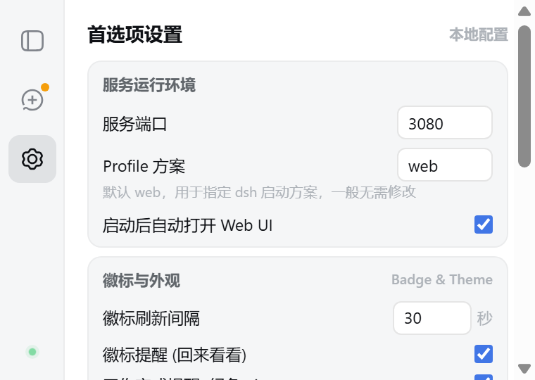
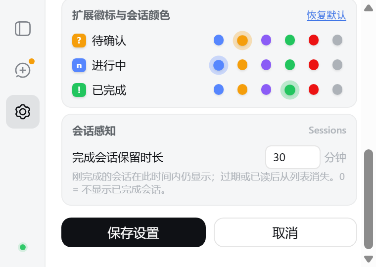

# Whalekeeper

> dsh 的浏览器开关：一键启动 / 停止 / 重启 `dsh web`，不碰终端。

答应我，不爱用 dsh web UI 的请划走👉
不会或者懒得敲终端启动命令的请留下🙏

我每天的固定节目是跟 dsh web 唠嗑🤖
我唯一不想开的窗口是终端🙅
我最喜欢的动物是鲸鱼🐋
我最喜欢的端口是 3080🔌
我最喜欢的运动是一键启动🏓
我最常忘的事是开完 dsh 不关，放它一头鲸在后台默默占端口😅
我最后的倔强是点一下浏览器图标，把上面这些破事全包了🙏

祝大家的 dsh 永远一键就绪🤩

——如果你没划走，来对地方了。**Whalekeeper** 把 `dsh web` 的开关装进你的浏览器工具栏：启动、停止、重启、状态徽标、会话状态感知、日志查看、页面内管理面板，全是弹窗一下的事，不用记命令、不用开终端。

<details>
<summary>截图速览（静态版）</summary>

| 服务概览 | 会话状态感知 |
|---|---|
|  |  |

| 首选项设置（上半屏） | 首选项设置（下半屏） |
|---|---|
|  |  |

| 深色主题（跟随 dsh Web UI） | |
|---|---|
|  | 与 dsh Web UI 同一套设计令牌与渲染标记，跟随 Web UI 实时同步。 |

- **服务概览**：状态卡（运行中 + 健康度 + PID/时长/node 版本）+「打开 DSH Web UI」+ 启动/停止/重启 + 优雅停机感知与「查看日志」入口。
- **会话状态感知**：只读会话摘要（不读消息内容）——待确认 > 进行中/已停止 > 已完成（新鲜显示）；已完成行可「已读」（3 秒可撤销）；活跃子代理在父行下成树展示。
- **首选项设置**（可滚动区，上下两屏）：上半屏 = 服务运行环境（端口/Profile/自动开 UI）+ 徽标与外观；下半屏 = 颜色角色（可改 待确认/进行中/已完成 三色）+ 会话感知（完成会话保留时长）+ 保存操作栏。

</details>

## 功能（全部已实现）

### 想开的时候

- **一键启动 / 停止 / 重启**：停止自动走 dsh-lifecycle 优雅停机，插件不在才强制降级
- **端口自由**：设置 `0` = 自动分配动态端口（启动后自动回填实际端口）；端口被占用时可直接换端口
- **识别外部 dsh**：终端里手工起过的 `dsh web`（任意端口）也会被自动认出，点「接管」后即可停止 / 重启

### 在用的时候，人不必停在 dsh 页面

- **徽标状态释放**：dsh 页面在后台时，会话状态直接搬上工具栏——进行中 = 蓝色工作数 n、待确认 = 黄「?」、工作完成 = 绿「!」；你在任何别的标签页都能扫一眼就知道该不该回去，不用来回切换 dsh 页面视奸会话状态；切回 dsh 页面即自动清除。工具栏图标另有角标表达实例状态（绿点运行 / 红点异常 / 无点停止）
- **页面内管理面板**：dsh Web UI 右下角自带管理徽章——实时状态、两步确认停止、重启，不用离开页面

### 想回来看看的时候

- **会话状态感知**：popup 会话区一眼看清扩展管理实例的会话状态——待确认 / 进行中 / 已停止（子代理还在跑）/ 已完成（在保留时长内显示）；已完成行可点「已读」（3 秒内可撤销）；活跃子代理在父行下成树展示；只读元数据、不读消息内容；行纯展示，导航走「前往 Web UI 统一处理」
- **日志查看页**：自动刷新尾部、逐块加载更早、一键复制全部

### 定制与安全

- **导轨式弹窗（380×270 物理锁定，零抖动）**：左侧导轨一键切换 概览 / 会话 / 设置三个视图；与 dsh Web UI 同一套设计令牌与官方原生视觉资产（小鲸鱼悬停游弋、[DSH WEB] 字标、进行中点阵）
- **颜色角色自定义**：待确认 / 进行中 / 已完成三色可改预设色板（点选即生效，一键恢复默认）；error 红与字符语义锁定，改红有撞色提示
- **主题四态**：跟随 Web UI（默认）/ 跟随系统 / 浅色 / 深色，随 dsh Web UI 实时同步
- **可配置**：端口、profile、自动打开 UI、徽标刷新间隔、完成会话保留时长、颜色角色、主题
- **安全克制**：只走 127.0.0.1 回环；不读不存你的 dsh 凭据；宿主只认本项目固定扩展 ID

## 安装（三步）

前置：Node ≥ 18，dsh 全局装好：

```powershell
npm i -g @deepseek-ai/dsh
```

**第一步**，跑安装脚本（先预演，再正式装）：

Windows（PowerShell）：

```powershell
powershell -ExecutionPolicy Bypass -File .\native-host\install.ps1 -DryRun
powershell -ExecutionPolicy Bypass -File .\native-host\install.ps1
```

Linux / macOS（sh，用户级注册、无需 sudo）：

```sh
sh native-host/install.sh --dry-run
sh native-host/install.sh
```

**第二步**，`chrome://extensions`（或 `edge://extensions`）→ 打开「开发者模式」→ 「加载已解压的扩展程序」→ 选本仓库 `extension` 目录。浏览器正在跑的话先**完全退出重启**再加载（宿主注册只在浏览器启动时读取）。

**第三步**，点工具栏图标 → 「启动」，就绪后自动打开 Web UI。

卸载：Windows 为 `powershell -ExecutionPolicy Bypass -File .\native-host\uninstall.ps1`；Linux / macOS 为 `sh native-host/uninstall.sh`（都支持保留日志：`-KeepLogs` / `--keep-logs`）。

> Windows 与 Linux 已实测；macOS 安装脚本同源（`uname` 分支）但未实测、Firefox 运行时未实测——详见下方「测试环境」。

## 配置

popup 设置面板（保存在 `chrome.storage.local`）：

| 配置项 | 默认值 | 说明 |
|--------|--------|------|
| port | `3080` | `0` = 自动分配，启动后从日志回填实际端口 |
| profile | `web` | 透传给 `dsh --profile` |
| host | `127.0.0.1` | 固定回环 |
| 自动打开 UI | 开 | 启动就绪后自动打开标签页 |
| 徽标刷新间隔 | 30 秒 | 图标徽标状态刷新周期（Chrome 最小周期 30 秒） |
| 徽标提醒（回来看看） | 开 | dsh 页面在后台时，工作完成 / 等待你拍板 → 徽标「!」/「?」提醒 |
| 徽标：工作完成提醒 | 开 | 「!」完成提醒的独立开关 |
| 完成会话保留时长 | 30 分钟 | 刚完成的会话在此时间窗内仍显示（0 = 不显示已完成会话；`5~1440`） |
| 颜色角色 | 待确认黄 / 进行中蓝 / 完成绿 | 三角色预设色板，改红系有撞色提示 |
| 外观 | 跟随 Web UI | 跟随 Web UI / 跟随系统 / 浅色 / 深色 |

## 使用说明

- **宿主未安装（HOST_NOT_INSTALLED）**：浏览器找不到本地宿主。重跑安装脚本并**完全重启浏览器**——宿主注册只在浏览器启动时读取：Windows 为 `native-host\install.ps1`，Linux / macOS 为 `native-host/install.sh`。
- **external 状态**：页面上检测到不是本扩展启动的 dsh web（比如你在终端手工跑过 `dsh web --port 4080`）。可以直接打开它的 UI 查看，或点「接管」后像自启动实例一样停止 / 重启（重启按原参数重放）；不接管就不动它。
- **端口占用**：popup 设置里换端口，或设成 `0` 自动分配动态端口（启动后自动回填实际端口）；占用者若是另一个 dsh web，会被识别为 `external`。
- **已读与保留时长**：会话区已完成行（无子代理在跑）只在「完成时长 ≤ 保留时间」内显示；点「已读」3 秒内可撤销，落库后该行隐藏；会话重新活跃会自动重现。已读记录只存在浏览器本地，不写入 dsh。
- **安全模型**：扩展与宿主仅经 127.0.0.1 回环通信；宿主只接受本项目固定扩展 ID；不读不存 dsh 凭据；状态文件与日志只落在本地（Windows 为 `%LOCALAPPDATA%\dsh-manager\`，Linux / macOS 为 `~/.config/dsh-manager` 或 `~/Library/Application Support`）。

## 测试环境

- **已验证**：Windows 11（Chrome / Edge）与 Kali WSL2（Linux）冒烟测试全过；真实 dsh 集成验证（启动 / 停止 / 动态端口 / 外部发现 / 会话端点与优雅停机全过）；扩展 UI 自动验收（headless Chrome + CDP，**97 条断言**）全过；dsh-lifecycle 插件单测 **33/33**。
- **未实测**：macOS（安装脚本同源实现，无设备）；Firefox 运行时（宿主注册已就绪，本机未装）；Chrome Web Store 上架（暂缓，本地开发者模式加载即可）。

## 更多

- 详细设计（架构 / 协议 / 安全 / 路线图）：[docs/design.md](docs/design.md)
- 开发、测试命令与提交规范：[CONTRIBUTING.md](CONTRIBUTING.md)
- UI 截图脚本（可复现静态预览图）：`tools/ui-theme/capture-readme-shots.js`
- dsh 本体：[github.com/deepseek-ai/deepseek-harness](https://github.com/deepseek-ai/deepseek-harness)
- 构建者：本项目由 **deepseek-v4-pro-0813**、**deepseek-v4-flash-0731 及其 Vision Exp 版本** 在 dsh 中构建；**gemini** 进行视觉辅助和 UI 优化
- 许可证：MIT（[LICENSE](LICENSE)）。鲸鱼 logo 等品牌素材版权归 DeepSeek 所有、不随 MIT 授权，见 [NOTICE](NOTICE)。

> 非官方社区工具，与 DeepSeek 官方无隶属关系；极端情况下强制停止可能丢最近几秒会话状态，使用前自行评估。
