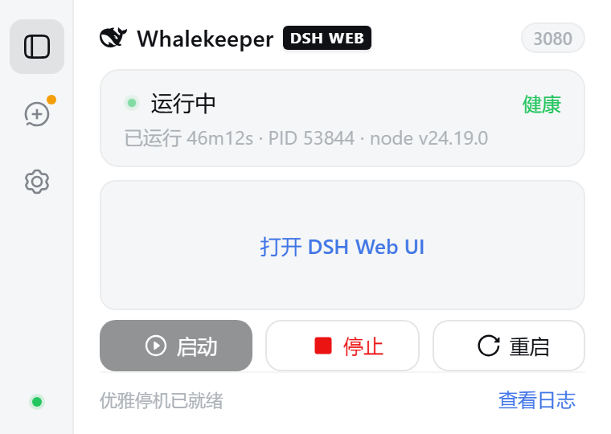
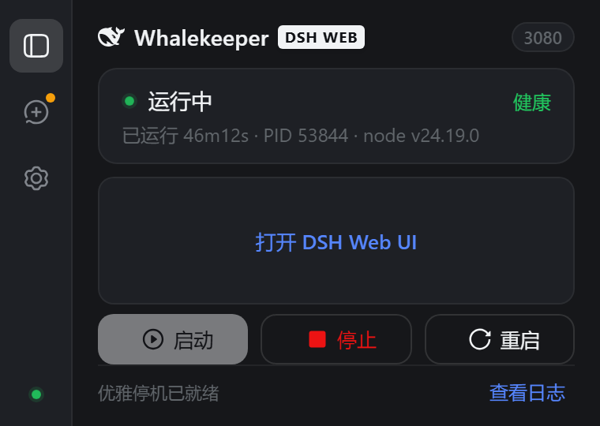
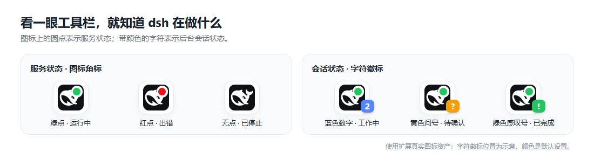
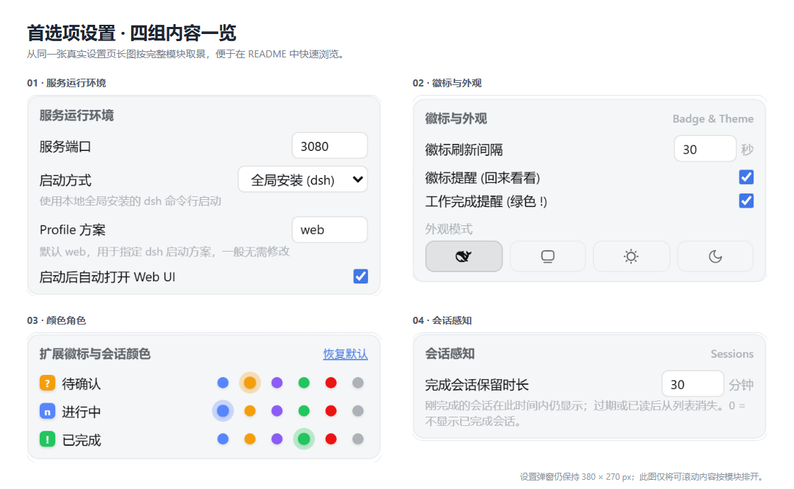
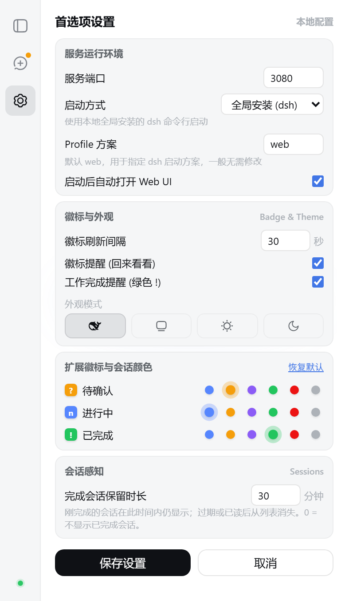

# Whalekeeper

浏览器中的 dsh Web 服务控制台：**启动 / 停止 / 重启 · 会话提醒 · 日志查看**。


<sub>主图中的会话标题使用公开演示数据；工具栏图示使用真实扩展图标，字符徽标的位置仅作示意。</sub>

## 快速开始

> 需要 Node.js 18+。默认模式使用全局安装的 dsh；也可以随后切换为 NPX 或已构建源码。

```powershell
npm i -g @deepseek-ai/dsh
powershell -ExecutionPolicy Bypass -File .\native-host\install.ps1 -DryRun
powershell -ExecutionPolicy Bypass -File .\native-host\install.ps1
```

Linux / macOS 使用 `sh native-host/install.sh --dry-run` 预演，随后运行 `sh native-host/install.sh`。然后完全重启浏览器，在 `chrome://extensions` 或 `edge://extensions` 开启开发者模式，加载 `extension/` 目录，点击扩展图标启动。

## 功能地图

| 服务 | 会话 | 外观 |
|:---:|:---:|:---:|
|  |  |  |
| 启停、重启、端口、健康状态、日志 | 待确认、进行中、已停止、已完成、子代理 | 跟随 Web UI / 系统，或固定浅色 / 深色 |

### 服务管理

- 弹窗和页面内管理面板都能操作 dsh；停止时优先尝试配套插件提供的优雅退出。
- 可识别外部启动的 dsh，并由你选择打开或接管。端口设为 `0` 时自动分配。
- 配套插件可主动报告就绪状态与实际端口；没有新版插件时仍可使用原有探测方式。
- 扩展与宿主只在本机回环地址通信；设置保存在浏览器本地，不读取或存储 dsh 凭据。

### 会话与提醒

- 工具栏徽标显示工作数量、待确认和完成提醒；弹窗提供只读状态摘要，点击会话行打开对应 Web UI 会话。
- 可以标记已完成会话为已读，并在 3 秒内撤销；可设置完成会话的保留时间。
- 会话摘要不包含消息内容；设置保存在浏览器本地。



| 工具栏位置 | 默认显示 | 含义 |
|---|---|---|
| 图标角标 | 绿点 / 红点 / 无点 | 服务运行中 / 出错或宿主未安装 / 已停止 |
| 字符徽标 | 蓝底 `n` | `n` 个会话工作中，超过 9 个显示 `9+` |
| 字符徽标 | 黄底 `?` | 有会话待确认或回答 |
| 字符徽标 | 绿底 `!` | 工作刚完成，提醒可单独关闭 |
| 字符徽标 | 空白 | 没有需要提示的会话状态 |

字符徽标在 dsh 页面处于后台时显示，回到页面后清除；优先级为 `?` → `!` → `n`。颜色角色可改蓝、黄、绿默认色，不改变字符含义或实例角标。

### 自定义



支持全局、NPX、本地源码启动方式，以及端口、主题、状态颜色、自动打开页面和提醒设置。本地源码模式需先完成依赖安装与构建，启动时暂不加载 profile 的 `mcp-ssh`，不会改写真实配置。

<details>
<summary>查看连续的设置页长图</summary>



</details>

## 常见问题

| 情况 | 处理方式 |
|---|---|
| 找不到本地宿主 | 重跑安装脚本，完全退出并重启浏览器 |
| 端口被占用 | 换端口或设为 `0`；若是外部 dsh，可选择接管 |
| 想看历史日志 | 从弹窗打开日志页，逐块加载更早内容或复制全部 |

### 卸载

Windows 运行 `powershell -ExecutionPolicy Bypass -File .\native-host\uninstall.ps1`；Linux / macOS 运行 `sh native-host/uninstall.sh`。需要保留日志时，分别加 `-KeepLogs` 或 `--keep-logs`。

Windows 11（Chrome / Edge）与 Kali WSL2 已验证；macOS 和 Firefox 运行时尚未实测。当前通过开发者模式加载，Chrome Web Store 上架暂缓。

## 文档改进计划

这版 README 已改为快速上手和图文状态说明，仍有明确的优化空间：

1. **工具栏实拍**：当前字符徽标图片是基于真实图标和默认色制作的示意图；后续用 Chrome / Edge 的真实工具栏截图核对和替换。
2. **阅读体验**：在 GitHub 的窄屏与深色页面复核主图、表格和设置总览的可读性，必要时调整图片裁切与顺序。
3. **平台指引**：取得 macOS / Firefox 运行环境并完成实测后，再补对应的安装、排错截图与步骤；同时固化这组 README 图片的生成流程。

进展和验收口径记在 [设计路线图](docs/design/07-roadmap.md)。

[设计规格](docs/design.md) · [贡献指南](CONTRIBUTING.md) · [LICENSE](LICENSE) · [NOTICE](NOTICE)
